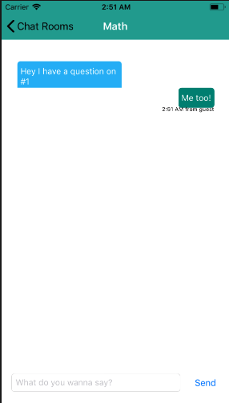

<h1>School Chat Demo</h1>

 
<b>Purpose of Software: </b>  

Software to enable Students and Teachers to have connect through chat rooms. 
It enable students to reach out to teachers for any help or discussion through chat rooms. 

This demo application runs in two mode: <b>Student and Teacher/Admin</b>  

For Teacher mode, teachers can add and remove classes (Also chat in the chat rooms).

For student mode, students are only allow to enter chat rooms and discuss. 

